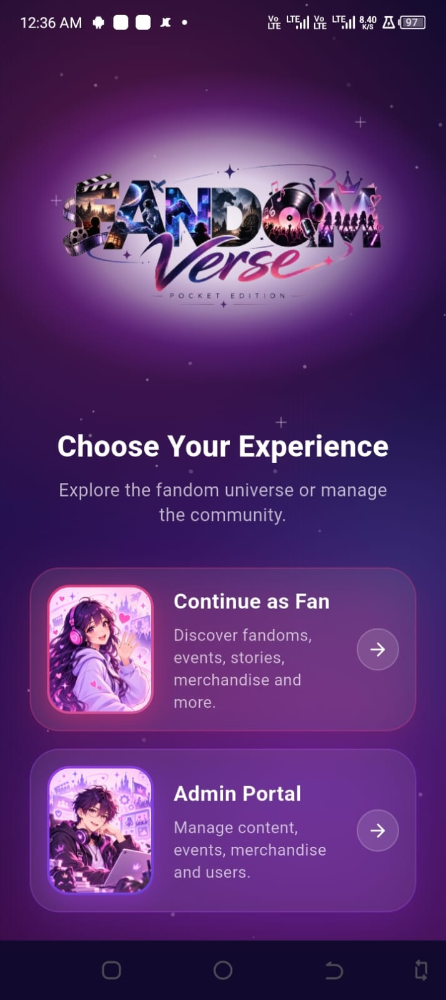
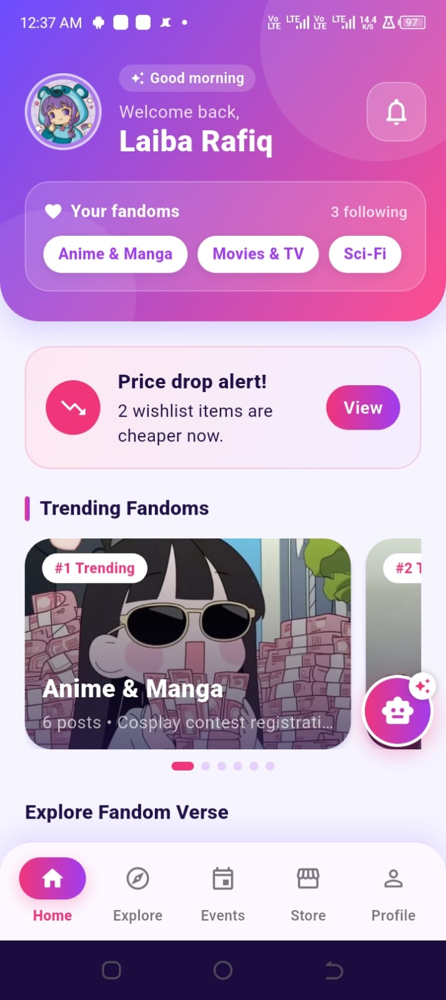
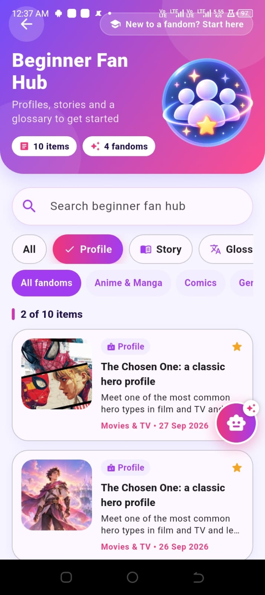
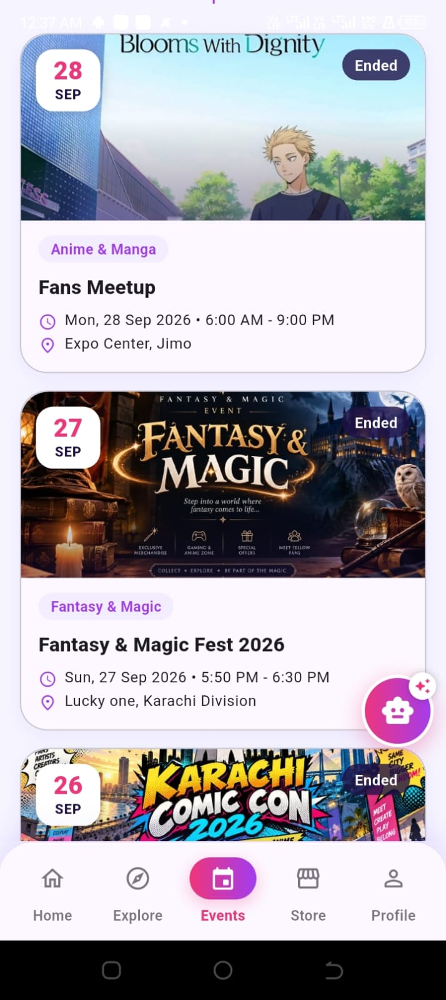
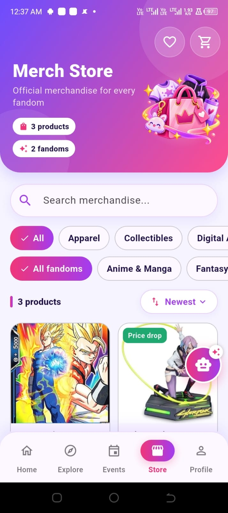
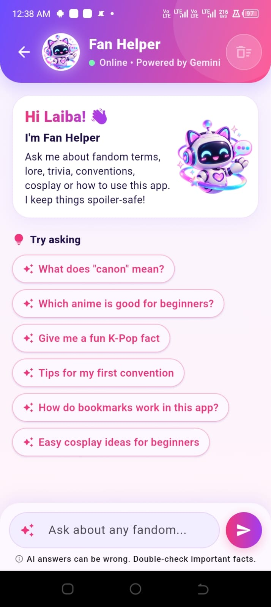
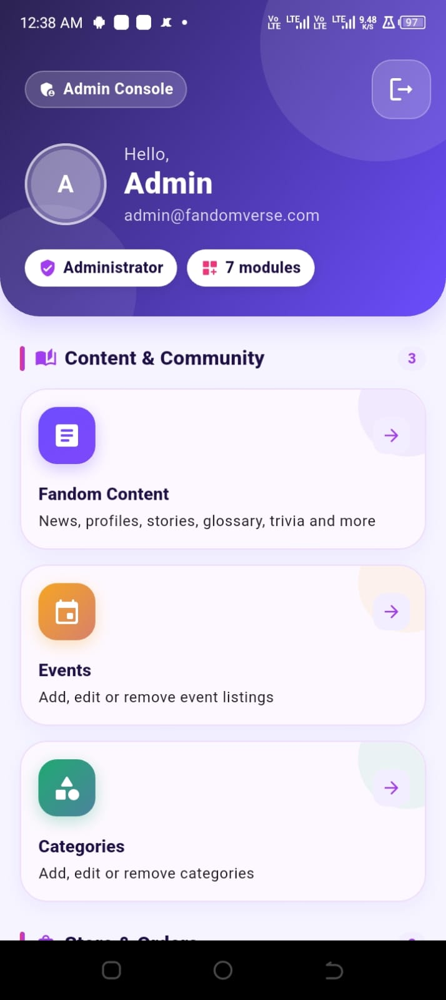

<div align="center">


# Fandom Verse – Pocket Edition

**Fandom Trivia on the Go**

A cross-platform mobile app for fans of anime, games, comics, movies, music and more, with fandom content, events, merchandise and an AI helper in one place.


</div>

---

## About the Project

New fans often feel lost among unfamiliar terms, long histories and news spread across many websites, while long-time fans want deeper trivia, upcoming events and official merchandise in one place. **Fandom Verse** brings all of this together in a single app with a pink and purple "galaxy" look.

The app has two roles:

- **Fan**: reads content, follows events, shops for merchandise, saves posts for offline reading and chats with the AI Fan Helper.
- **Admin**: manages content, events, products, categories, orders, messages and user accounts from one console.

Built by **Team NN2_CrossWave** of **Aptech North Nazimabad II, Karachi** for **TechWiz 7 – Multi-Platform App Computing**.

---

## Features

### Fan

| Area | What fans can do |
|---|---|
| **Accounts** | Sign up with email or Google, reset password, set up a profile with fandom interests and badges |
| **Home** | Time-based greeting, "Your fandoms", Trending Fandoms carousel, price-drop alerts and quick tiles |
| **Content** | Beginner Fan Hub (profiles, stories, glossary), Resources (news, galleries, videos, podcasts) and Deep Dive (trivia, lore, interviews) with search and filters |
| **Offline reading** | Bookmark any post and read it later without internet |
| **Events** | List, calendar and map views, city filter, "Near me", directions, tickets, and reminders 2 days, 1 day and 2 hours before an event |
| **Merch Store** | Apparel, collectibles and digital assets, sizes, cart, wishlist with price-drop alerts, simulated checkout, bill and order tracking |
| **AI Fan Helper** | Short, spoiler-safe answers to fandom questions (Gemini via Firebase AI Logic) |
| **Notifications** | New events, trending posts, order updates, enquiry replies and price drops |
| **More** | Profile, Contact Us (with office map and message history) and About Us |

### Admin

| Module | What admins can do |
|---|---|
| **Fandom Content** | Add, edit and delete posts of 10 types, upload up to 5 images, feature posts in Trending, add sample content |
| **Events** | Add events with banner, date and time, and a map picker that fills in City, Venue and Address automatically |
| **Merchandise** | Add products with images, category-specific options (sizes, collectible type, digital asset type); lowering a price alerts fans |
| **Orders** | Track all orders and move them through Processing → Shipped → Delivered, or cancel before shipping |
| **Enquiries** | Read Contact Us messages, reply by email, call, mark as resolved |
| **Users** | View, add, edit and block fan accounts |
| **Categories** | Add, edit and delete fandom categories with images |

---

## Screenshots

<!-- Save your screenshots in docs/screenshots/ with these names, then push. -->

| Splash | Role Selection | Home | Content |
|:---:|:---:|:---:|:---:|
|  |  |  |  |

| Events | Store | AI Fan Helper | Admin Console |
|:---:|:---:|:---:|:---:|
|  |  |  |  |

---

## Tech Stack

| Layer | Technology |
|---|---|
| Framework | Flutter (Dart 3.5+) |
| Authentication | Firebase Authentication (Email/Password, Google Sign-In) |
| Database | Cloud Firestore (with offline persistence) |
| AI | Firebase AI Logic (Google Gemini) |
| Push notifications | Firebase Cloud Messaging + flutter_local_notifications |
| Image storage | Cloudinary (unsigned upload preset) |
| Maps | OpenStreetMap (flutter_map), Nominatim search, Geolocator |
| State management | StatefulWidget, StreamBuilder and ValueNotifier with singleton services |

---

## Project Structure

```
lib/
├── config/          App and AI configuration
├── core/            Constants, theme (colours, gradients) and utilities
├── models/          Data classes (fromDoc / toMap)
├── routes/          Navigation helpers
├── screens/
│   ├── auth/        Role selection, login, sign up, forgot password, profile setup, AuthGate
│   ├── common/      Splash and shared screens
│   ├── fan/         Home, content, events, store, profile, AI helper, notifications, info
│   └── admin/       Console and all management screens (+ shared admin widgets)
├── services/        Firebase, Cloudinary, maps, notifications and business rules
└── widgets/         Reusable UI components
```

---

## Getting Started

### Requirements

- Flutter SDK with Dart 3.5 or newer
- Android Studio or VS Code with the Flutter and Dart extensions
- An Android phone (Android 7.0 or newer) or emulator

### Run the app

```bash
git clone https://github.com/Laiba-Rafiq/Fandom-Verse---Pocket-Addition.git
cd Fandom-Verse---Pocket-Addition
flutter pub get
flutter run
```

### Build a release APK

```bash
flutter build apk --release
```

The APK is created at `build/app/outputs/flutter-apk/app-release.apk`.

### Using your own Firebase project

The repository is already connected to the team's Firebase project. To use your own:

1. Create a Firebase project and run `flutterfire configure`.
2. Enable **Email/Password** and **Google** sign-in, and add your SHA-1 key for Google sign-in.
3. Create a **Cloud Firestore** database and publish the security rules.
4. Enable **Firebase AI Logic** (Gemini Developer API).
5. Create an **unsigned upload preset** in Cloudinary and update the settings in `lib/config/`.
6. Create the first admin: add a user in Firebase Authentication, then set `users/{uid}.role` to `"admin"` in Firestore.

> No API secrets are stored in the app. Images use an unsigned Cloudinary preset, and the AI Fan Helper goes through Firebase AI Logic.

---

## Notes

- Checkout is **simulated**: no real payment, delivery or stock tracking. Prices are in Pakistani Rupees (Rs.).
- Admin accounts are created by the team in Firebase, not inside the app.
- Push notifications when the app is fully closed are sent from the Firebase console.
- The app has been tested on Android. iOS is configured but not tested.

---

## Team NN2_CrossWave

| Member | Student ID |
|---|---|
| Laiba Rafiq | 1729813 |


**Aptech North Nazimabad II, Karachi, Pakistan**

---

## Acknowledgements

- **TechWiz 7** by Aptech for the project brief.
- AI tools used during the project: **Claude (Anthropic)** for coding help, debugging and documentation drafting; **ChatGPT (OpenAI)** for artwork; **Google Gemini** (via Firebase AI Logic) inside the app for the AI Fan Helper.
- Map data © OpenStreetMap contributors.

<div align="center">

Made with 💜 for fans, by fans.

</div>